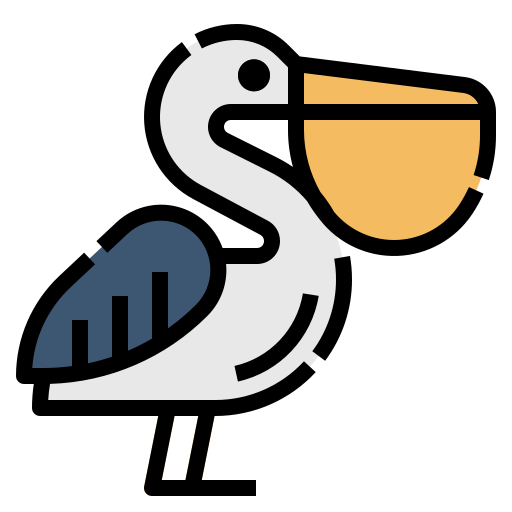

# Pylican - A Programming Game for Kids

## Overview
Pylican is an educational game designed to teach children how to code in Python. With Pylican, players learn programming concepts such as loops, functions, and variables while having fun. The game is suitable for beginners, and it's an excellent tool for parents and teachers who want to introduce their kids to coding.

Pylican has different levels of difficulty, and each level introduces new programming concepts and challenges. The game features a comprehensive tutorial that teaches players how to use Python, and it also provides hints and tips to help players solve the challenges. 

Pylican is an open-source project, and anyone can contribute to the game by adding new features, fixing bugs, or translating the game to different languages. We believe that coding is an essential skill for the future, and our mission is to make coding education accessible to everyone.

## Programming Concepts
- [Sequence](./notebooks/sequence.ipynb)
- [Selection]()
- [Iteration]()
- [Subroutines]()

## Supported Platforms
[TBD]

